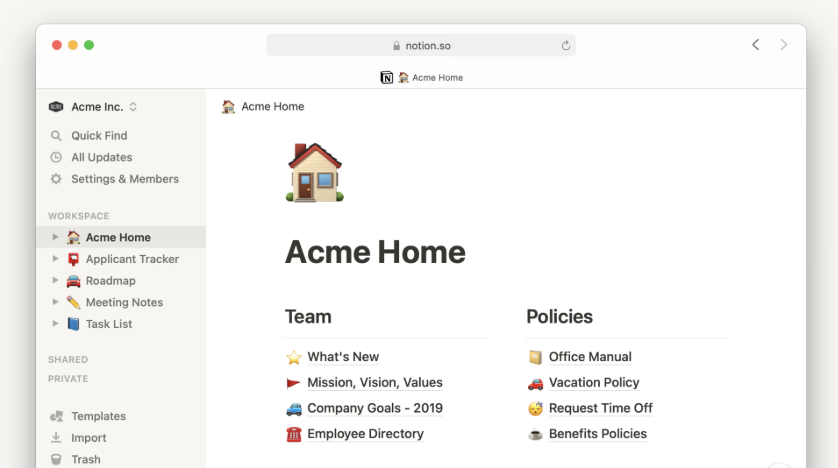

Project: NoteStack - A minimal alternative to Notion
Goal: Create a lightweight note workspace for personal use and public users
Target Users: Developers, Students, Personal Productivity Users

Features for version 1:
 - User login/signup
 - Create notes
 - Edit notes
 - Delete notes
 - Simple folder structure
 - Autosave

 Tech Stack:
 1) Frontend:
  - Next.js
 2) Backend:
  - Node.js
  - Express.js
 3) Database:
  - MongoDB
 4) Editor:
  - TipTap Editor
 5) Hosting:
  - Vercel

UI Design:
 - We will follow minimal design like Notion with subtle colors and consistent ui components
 - Pages we will be needing:
  1) Login Page
  2) Dashboard
  3) Note Editor
  4) Sidebar with pages

  

Design Database:
 - Users Collection
  id
  name
  email
  password
  createdAt
  
 - Notes Collection
  id
  userId
  title
  content
  parentNoteId
  createdAt
  updatedAt